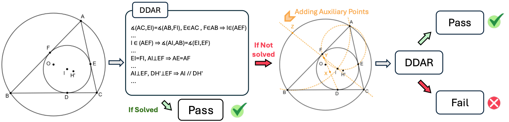

<h1 align="center">
<!--  -->
<!-- <br> -->
<!-- <br style="display: block; content: ''; margin-top: 0.5em;" /> -->
Gold-Medal-Level Olympiad Geometry Solving with Efficient Heuristic Auxiliary Constructions</span>
</h1>

<div align="center">


</div>

<p align="center">
  <!-- <a href="https://mastervito.github.io/SvS.github.io/"><b>[🌐 Website]</b></a> • -->
  <a href="https://huggingface.co/datasets/HAGeo-IMO/HAGeo-409"><b>[🤗 Benchmark]</b></a> •
  <a href=""><b>[📜 Paper]</b></a> •
  <a href="https://github.com/boduan1/HAGeo"><b>[🐱 GitHub]</b></a> •
  <a href="X"><b>[🐦 Twitter]</b></a> •
  <a href="R"><b>[📕 Rednote]</b></a>
</p>


<p align="center">
Repo for "<a href="P" target="_blank">Gold-Medal-Level Olympiad Geometry Solving with Efficient Heuristic Auxiliary Constructions</a>"
</p>

<p align="center">
    
        <br>
    <em>Figure 1: Overview of the HAGeo method. First, the DDAR engine deduces new statements in the problem. If the DDAR does not solve the problem, our heuristic-based strategy gives additional attempts for adds auxiliary constructions to help solve the problem and re-runs the DDAR.
    </em>
</p>


## 🔥 News
- [2025/11/27] Our full code is under review by Microsoft and will be released upon approval.
- [2025/11/27] The HAGeo paper, repo, and the <a href="https://huggingface.co/datasets/HAGeo-IMO/HAGeo-409">HAGeo-409 benchmark</a> are all released.
- [2025/11/27] HAGeo is the first framework to <b>achieve gold-medal-level human performance on IMO-level geometry problem solving without using any neural models for inference</b>.

## 💡 Introduction 
<div style="text-align: justify;">
In the HAGeo framework (Figure. 1), a geometry problem is first converted into our geometry-specific language and then processed to encode all its properties into a deduction graph. The Deduction Database (DD) and Algebraic Reasoning (AR) engines expand the deduction graph through a brute-force search over all deduction rules and by performing algebraic deductions involving equations of length, ratio, or angle. If the DDAR fails to solve the problem, we further attempt K different auxiliary constructions based on our heuristic strategies, and the DDAR engine is rerun for each attempt. 

<br>

## 📏 HAGeo-409 Benchmark
We create the HAGeo-409 benchmark, which comprises 409 IMO-level geometry theorem-proving problems and **typically presents greater difficulty than the widely used IMO-30 benchmark.**

<p align="center">
    
        <br>
    <em>Figure 2: Problem difficulity distribution of the IMO-30 benchmark and our new HAGeo-409 benchmark. 
    </em>
</p>


## 📊 Evaluation

**Table 1. Results on the HAGeo-409 benchmark across different difficulty levels.**

<table border="1" cellpadding="6" cellspacing="0" style="border-collapse: collapse; text-align:center;">
  <thead>
    <tr style="background-color:#f2f2f2;">
      <th>Level</th>
      <th>Count</th>
      <th>AlphaGeometry<br>16-64-8</th>
      <th>Random<br>@2048</th>
      <th>HAGeo<br>@2048</th>
      <th>Random<br>@8192</th>
      <th>HAGeo<br>@8192</th>
    </tr>
  </thead>
  <tbody>
    <tr>
      <td>1–3</td>
      <td>161</td>
      <td>118 (73.3%)</td>
      <td>127 (78.9%)</td>
      <td>141 (87.6%)</td>
      <td>128 (79.5%)</td>
      <td>149 (92.5%)</td>
    </tr>
    <tr>
      <td>3–4</td>
      <td>112</td>
      <td>44 (39.3%)</td>
      <td>62 (55.4%)</td>
      <td>87 (77.7%)</td>
      <td>69 (61.6%)</td>
      <td>93 (83.0%)</td>
    </tr>
    <tr>
      <td>4–5</td>
      <td>71</td>
      <td>13 (18.3%)</td>
      <td>13 (18.3%)</td>
      <td>29 (40.8%)</td>
      <td>18 (25.4%)</td>
      <td>36 (50.7%)</td>
    </tr>
    <tr>
      <td>5–6</td>
      <td>43</td>
      <td>2 (4.7%)</td>
      <td>2 (4.7%)</td>
      <td>5 (11.6%)</td>
      <td>3 (7.0%)</td>
      <td>7 (16.3%)</td>
    </tr>
    <tr>
      <td>6–7</td>
      <td>22</td>
      <td>0 (0.0%)</td>
      <td>0 (0.0%)</td>
      <td>1 (4.5%)</td>
      <td>0 (0.0%)</td>
      <td>2 (9.1%)</td>
    </tr>
    <tr>
      <td>Total</td>
      <td>409</td>
      <td>177 (43.3%)</td>
      <td>204 (49.9%)</td>
      <td>263 (64.3%)</td>
      <td>218 (53.3%)</td>
      <td>287 (70.2%)</td>
    </tr>
  </tbody>
</table>

</br>

**Table 2. Comparison on the IMO-30 benchmark**

| Method                           | IMO-30 |
|----------------------------------|--------|
| DDAR                             | 15     |
| AlphaGeometry                    | 24*    |
| Random Auxiliary Points + DDAR   | 25     |
| **HAGeo**                        | **28** |


## ☕️ Citation

If you find this repository or our benchmark helpful, please consider citing our paper:

```
```

## 🌟 Star History

[](https://star-history.com/#boduan1/HAGeo&Date)